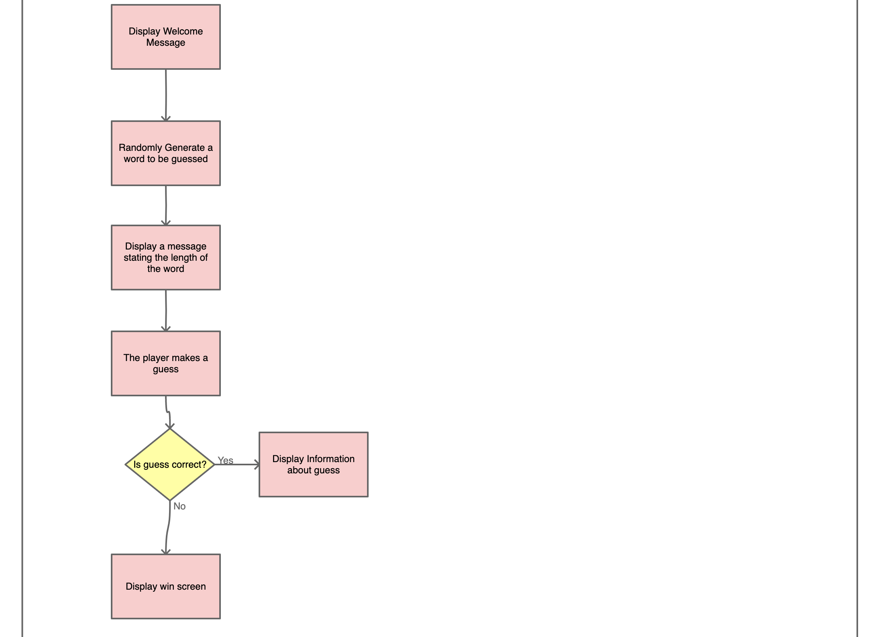
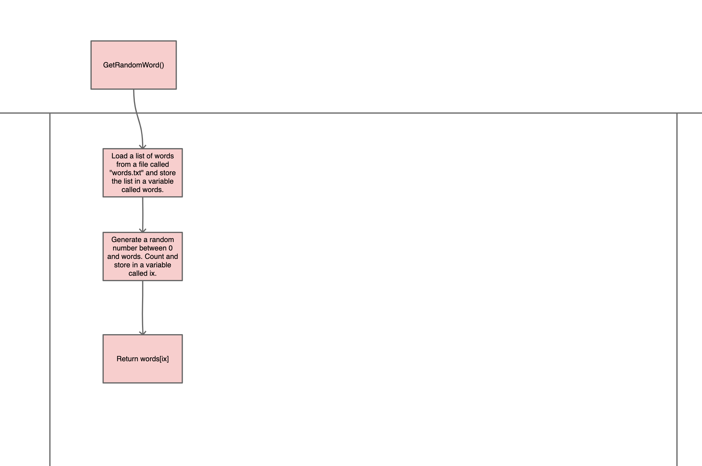
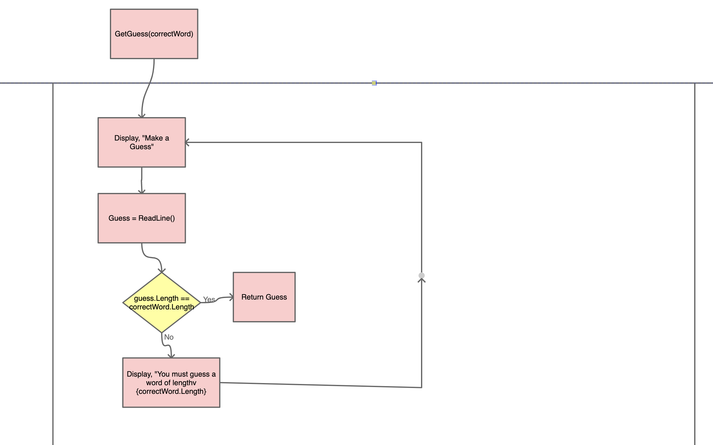
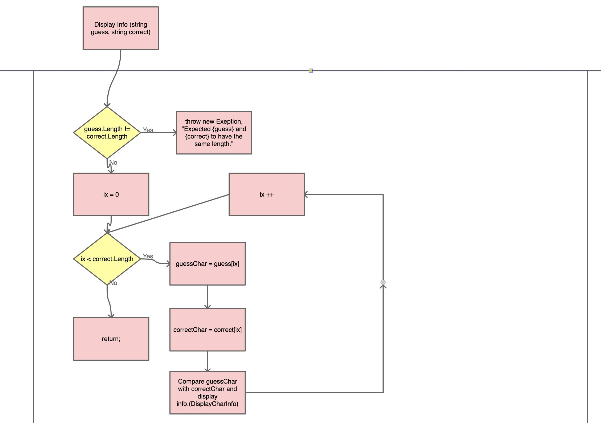
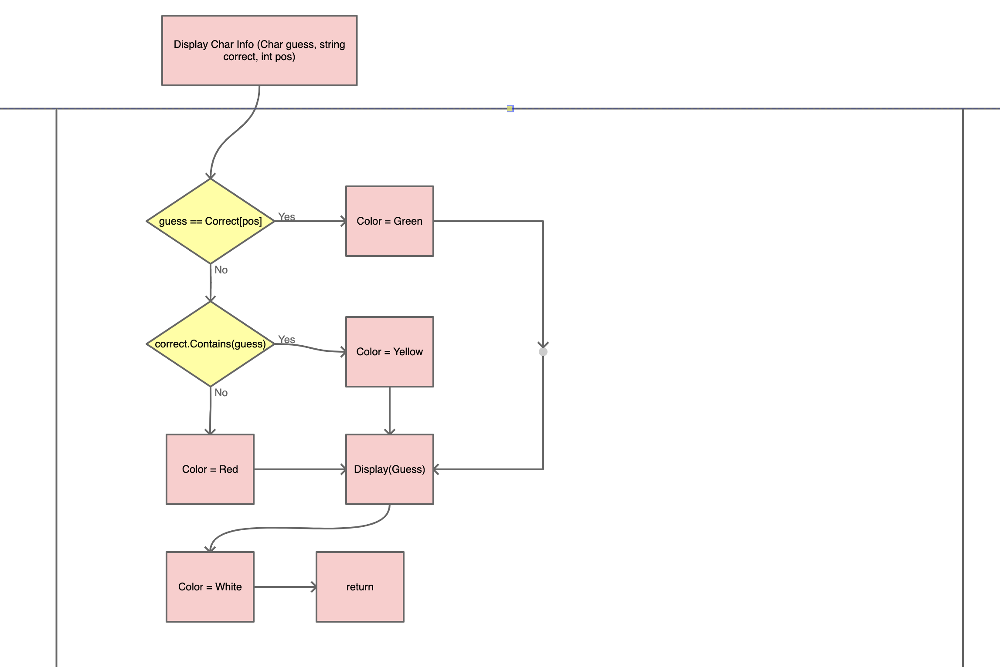

# WordleProject

## Description:
#### The Wordle game is a guessing game in which the user guesses the hidden word. The user is give the length of the hidden word, with which they make a guess, are told which letters they guessed are in the word, which letters are not in the word, and which letters are in the hidden word and in the correct location.

## OverView:
#### The ultimate goal of the Wordle game is to challenge and entertain the user with a difficult word game. The Wordle game functions by taking in the users guesses then returning the results based on the users guesses.

## High Level Design:
#### At a high level the game works in the following way:

#### 1. Displays a Welcome Message
#### 2. A random word is then generated
#### 3. The player is asked to make a guess
#### 4. If the guess is correct, the player wins
#### 5. If the guess is incorrect:
#### - The player receives information based on their guess
#### - The game continues to step 3

### FlowChart:

## Methods and Classes:
#### The four methods I have chosen are:
#### - void GetRandomWord();
#### - string GetGuess(string correctWord);
#### - void DisplayInfo(string guess, string correct);
#### - void DisplayCharInfo(char guess, int pos, string correct);

### Question Class:
#### - string correctWord
#### - string guess
#### - string correct
#### - char guess
#### - int pos

## GetRandomWord()

#### 1. Load a filed called words.txt
#### 2. Store each line as a separate word in a list named words
#### 3. Generate a random number between 0 and words.Count and store the result in a variable called ix
#### 4. Return the word at position ix. (e.g. words[ix])

## string GetGuess(string correctWord)

#### 1. Prompt the user to make a guess
#### 2. Read input from the keyboard and store the results in a variable named guess
#### 3. If guess is the correct length (the guess and random word should be the same length), return the guess.
#### 4. Otherwise, display an error message and ask them to make another guess.

## void DisplayInfo(string guess, string correct)

#### 1. Validate that the guess and correct word are the same length
#### 2. If the lengths do not match, throw an exception
#### 3. If they match, iterate through each character:
#### - Use the DisplayCharInfo method to determine what color to print the character

## void DisplayCharInfo(char guess, int pos, string correct)

#### 1. If the guess is in the correct position, select the color green.
#### 2. If the guess is in the correct word but not correct position, select yellow.
#### 3. If the guess is not in the correct word, select red.
#### 4. Display the guess
#### 5. Reset the color back to white before returning